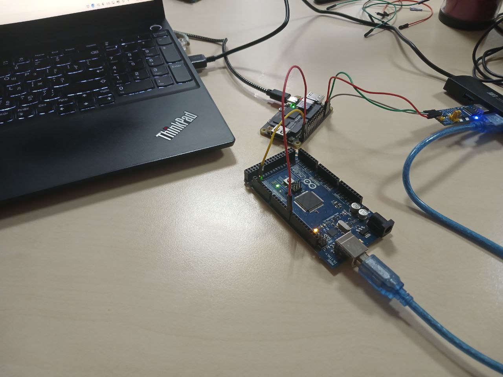

# Тестирование Lichee RV Dock 



## Схема стенда

Текущая реализация предполагает собой схему, при которой 
- Lichee RV Dock (при желании и небольших изменениях любая другая плата) - исследуемая плата.
- Arduino Mega 2560 - инструмент тестирования;
- ПК - место сбора данных и их визуализации.

[Пример визуализации результатов](/code_for_riscv/rt-tests/results/avg_plot_session_858947_20260119_180552.png)

[JSON со статистикой](/code_for_riscv/rt-tests/results/session_858947_20260119_180552.json)

Схема подключения:

 - Arduino pin 7 → Lichee pin PE16(GPIO 144)
 - Lichee pin PE12(GPIO 140) →  Arduino pin 19


## Код для ПК

[Код для ПК](/code_for_riscv/rt-tests/pc_example.py)

Код на Python управляет измерениями задержек между Arduino Mega и Lichee RV Dock. Он подключается к Arduino через последовательный порт, отправляет команды управления и принимает обработанные данные в формате JSON. Программа работает в интерактивном режиме с консольным управлением.

После запуска код автоматически ищет подключенную Arduino Mega по доступным COM-портам или запрашивает порт вручную. Установив соединение, программа переходит в режим командной строки, где пользователь может управлять измерениями: запускать сбор данных, запрашивать результаты, сбрасывать измерения и проверять статус.

Когда Arduino отправляет обработанные данные (усредненные значения по 10 группам по 100 измерений), программа парсит JSON, выводит статистику на экран, сохраняет данные в файлы JSON и CSV, а также строит два графика: время отклика по группам и период между ответами по группам. Все файлы сохраняются в директорию arduino_measurements с уникальными именами, содержащими идентификатор сессии и временную метку.

## Код для Arduino

[Код для Arduino](/code_for_riscv/rt-tests/arduino_example.ino)

Код на Arduino C измеряет задержки в системе связи с Lichee RV Dock. Он отправляет импульсы через пин 7 и принимает ответные сигналы через пин 19. Для каждого импульса измеряется **время отклика системы**(разница между отправкой сигналом на Lichee и получением ответного) и **период между ответными сигналами**.

Программа собирает данные группами: всего 10 групп, в каждой по 102 измерения. Но первые 2 измерения в каждой группе пропускаются для исключения переходных процессов. После сбора каждой группы вычисляется **среднее арифметическое** и **среднеквадратичное отклонение** как для **времени отклика**, так и для **периода**.

Ардуино работает в циклическом режиме отправки импульсов с фиксированной задержкой 1000 микросекунд между ними. Прерывание по фронту на входном пине фиксирует момент получения ответа от Lichee. По команде START производится сбор данных.

После сбора всех 10 групп программа формирует JSON-пакет со статистикой по каждой группе и общей сводной статистикой, который отправляется на ПК по запросу SEND.

Управление осуществляется через последовательный порт командами START, SEND, STATUS и RESET. Каждая сессия измерений имеет уникальный идентификатор для последующего анализа данных на компьютере.

## Код для Lichee

[Код для Lichee](/code_for_riscv/rt-tests/lichee_example.c)

Собрать код для Lichee:

```
gcc lichee_example.c -lgpiod -o lichee_example
```

Код на C работает на Lichee RV Dock и реализует ответную логику в системе измерений. Программа настраивает два GPIO-пина: один как вход для приема импульсов от Arduino, второй как выход для отправки ответных сигналов.

Код использует библиотеку gpiod для работы с GPIO и ожидает сигнала прерывания SIGINT для корректного завершения. При запуске программа открывает GPIO-контроллер /dev/gpiochip0, конфигурирует пины с соответствующими смещениями в линии GPIO и переходит в цикл ожидания событий.

Основная логика заключается в детектировании переднего фронта на входном пине. Когда Lichee обнаруживает переход сигнала из низкого состояния в высокое (импульс от Arduino), она немедленно устанавливает высокий уровень на выходном пине, формируя ответный импульс. При обнаружении спадающего фронта на входе Lichee сбрасывает выходной сигнал в ноль. Таким образом, код реализует минимальную задержку между получением импульса от Arduino и отправкой ответа, что позволяет измерять время прохождения сигнала в системе. Программа работает непрерывно до получения сигнала прерывания, после чего корректно освобождает все ресурсы GPIO.

